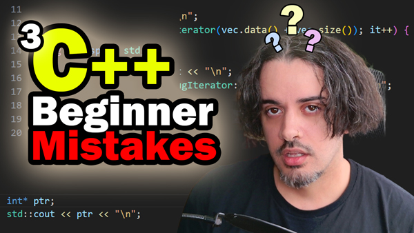

# C++ Misconceptions - Common Beginner Mistakes

<div style="text-align: center;">
    
</div>

## 📌 About This Project
This project demonstrates **3 common misconceptions in C++** that can lead to **performance issues, debugging nightmares, and even crashes**.  
Each misconception is explained with **clear examples and code that highlights the issue**.

This project is part of a **YouTube tutorial** covering best practices and common C++ mistakes.

---

## 📂 Project Structure

| File | Description |
|------|------------|
| `item1_using_std_namespace_is_fine.cpp` | Demonstrates why `using namespace std;` can cause **naming conflicts**. |
| `item2_post_increment_is_always_fine.cpp` | Shows why `i++` vs `++i` matters, especially for **iterators and objects**. |
| `item3_uninitialized_pointers_are_not_null.cpp` | Explains why **uninitialized pointers** hold **garbage values**, not `nullptr`. |
| `test.bat` | Windows batch script to compile and run the selected C++ file. |
| `test.sh` | Linux/macOS shell script to compile and run the selected C++ file. |

Each example includes **comments explaining the misconception** and the **correct approach**.

---

## 🛠️ Requirements

To compile and run these examples, ensure you have:

- **g++ (GNU Compiler Collection) with C++17 support**
- A **Windows or Linux/macOS system**
- A **terminal or command prompt** to compile and execute the code

Check if `g++` is installed by running:

```sh
g++ --version
```

If not installed, you can install it using:

🔹 Windows (via MinGW)
1. Download MinGW from MinGW-w64.
2. Install it and add g++ to the system path.
3. Verify installation by running g++ --version.

🔹 Linux/macOS
```sh
sudo apt install g++   # Debian/Ubuntu
sudo yum install gcc-c++  # Fedora/CentOS
brew install gcc  # macOS (using Homebrew)
```

## 📜 Automated Compilation & Execution

### Windows (test.bat)
```sh
./test.bat
```

### Linux/macOS (test.sh)
```sh
./test.sh
```

---

## 📺 YouTube Tutorial
This project is part of a [**YouTube tutorial**](https://youtu.be/8LFtDRSw5E8) that explains the code in detail. Watch the video to follow along.

---

## 📜 License
This project is licensed under the **MIT License**.

Happy coding! 🚀
